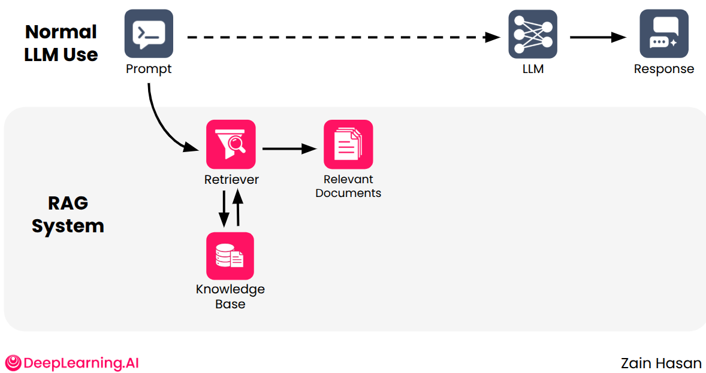

# Module 1: Retrieval Augmented Generation (RAG) Overview

This document serves as a comprehensive study guide for Module 1. It explains the core concepts of RAG, how it operates under the hood, and provides practical, step-by-step code examples to help you understand how to build a RAG pipeline from scratch.

---

## 1. The Problem with Large Language Models (LLMs)
While Large Language Models (like ChatGPT or Qwen) are excellent at generating text, they face two major limitations:
1. **Knowledge Cutoff:** The model has no awareness of events, documents, or data created after its training data was collected.
2. **Hallucination:** If you ask the model about highly specialized, private, or recent information, it might confidently generate a plausible but entirely incorrect answer.

**The Solution?** A **Retrieval Augmented Generation (RAG)** system.

---

## 2. What is RAG and How Does it Work?
RAG is a technique that combines the power of "Retrieval" (searching for information) with "Generation" (creating a response).
Instead of asking the LLM to rely purely on its internal memory, we follow these steps:
1. Search our internal Knowledge Base for documents or data related to the user's query.
2. Retrieve the most relevant documents and inject them into our Prompt.
3. Send the Augmented Prompt (which now contains the user's question + accurate context) to the LLM and instruct it to answer strictly based on the provided information.

### RAG Architecture Diagram:


---

## 3. Practical Implementation (Step-by-Step)

In the module's labs, we build a simplified RAG pipeline from scratch. Let's break the code down into 3 main components to understand how it works.

### Step 1: Retrieval (Finding Relevant Data)
How does a computer understand that a specific document is relevant to a user's question?
It uses **Embeddings** (numeric representations of text). We convert text into arrays of numbers (Vectors) and measure the similarity between them using a mathematical operation called **Cosine Similarity**.

**Practical Code Example:**
```python
from sentence_transformers import SentenceTransformer
from sklearn.metrics.pairwise import cosine_similarity
import numpy as np

# 1. Load the Embeddings model (converts text to vectors)
model = SentenceTransformer("BAAI/bge-base-en-v1.5")

# (In the lab, we load pre-computed vectors for the news dataset)
# EMBEDDINGS = joblib.load("embeddings.joblib")

def retrieve(query, embeddings, top_k=5):
    # Convert the user's query into a numeric vector
    query_embedding = model.encode(query).reshape(1, -1)
    
    # Calculate the similarity between the query and all documents in our database
    similarity_scores = cosine_similarity(query_embedding, embeddings)[0]
    
    # Sort the results to find the most similar documents
    similarity_indices = np.argsort(-similarity_scores)
    
    # Return the indices of the top 'k' documents
    return similarity_indices[:top_k]
```

### Step 2: Prompt Augmentation (Formatting the Context)
Now that we have retrieved the relevant documents, we need to format them into readable text and inject them into the Prompt so the LLM can process them.

**Practical Code Example:**
```python
def format_relevant_data(relevant_docs):
    """
    Takes the retrieved documents and formats them into a structured text layout.
    """
    formatted_documents = []
    for doc in relevant_docs:
        entry = (
            f"Title: {doc['title']}\n"
            f"Description: {doc['description']}\n"
            f"Published at: {doc['published_at']}\n"
            f"URL: {doc['url']}\n"
        )
        formatted_documents.append(entry)
    
    # Join all formatted documents into a single massive string
    return "\n".join(formatted_documents)

def build_augmented_prompt(query, relevant_docs):
    """
    Builds the final prompt that will be sent to the LLM.
    """
    context = format_relevant_data(relevant_docs)
    
    # Construct the prompt with our rules, the retrieved data, and the user's query
    prompt = f"""
Answer the user query below. There will be provided additional information for you to compose your answer. 
The relevant information provided is from 2024 and it should be added as your overall knowledge to answer the query.

2024 News:
{context}

Query: {query}
"""
    return prompt
```

### Step 3: The LLM Call (Generating the Answer)
We now have our Augmented Prompt ready. We will send it to the LLM to get our final grounded answer. (The course uses Together.ai, which provides an API compatible with the standard OpenAI SDK).

**Practical Code Example:**
```python
import os
from openai import OpenAI

# Initialize the client to connect to Together.ai
client = OpenAI(
    api_key=os.environ.get("TOGETHER_API_KEY"),
    base_url="https://api.together.xyz/v1"
)

def call_llm(augmented_prompt):
    # Send the augmented prompt to the LLM
    response = client.chat.completions.create(
        model="Qwen/Qwen3.5-9B",
        messages=[{"role": "user", "content": augmented_prompt}],
        max_tokens=500,
        temperature=0.7 # Controls the randomness/creativity of the response
    )
    
    # Return the generated text
    return response.choices[0].message.content
```

---

## 4. Summary
In short, a RAG system acts like an intelligent research assistant.
- The user asks a question (`query`).
- Instead of answering from memory (which might cause hallucination), the system searches its library (`Retrieval & Embeddings`).
- It extracts the specific pages containing the answer (`format_relevant_data`).
- It passes these pages along with the question to an intelligent reader (the LLM) to summarize and provide a clean, accurate answer (`Augmentation & LLM Call`).

---

## 5. Contents of this Directory (`Module_1_RAG_Overview`)
- **`README.md`**: This file (your comprehensive study guide).
- **`rag_overview.png`**: The architectural diagram of a RAG system.
- **`rag_pipeline_summary.py`**: A clean, consolidated Python script containing the entire end-to-end RAG pipeline discussed above. You can run and experiment with it directly.
- **`labs/`**: A folder containing the original Jupyter Notebooks (Assignments & Ungraded Labs) and datasets (CSV and Joblib files) from the course environment.
